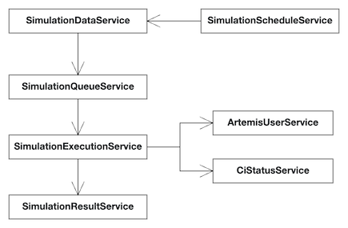
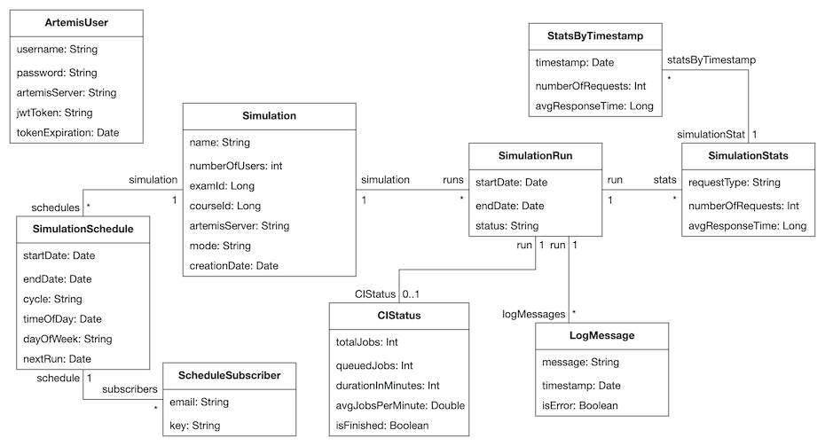
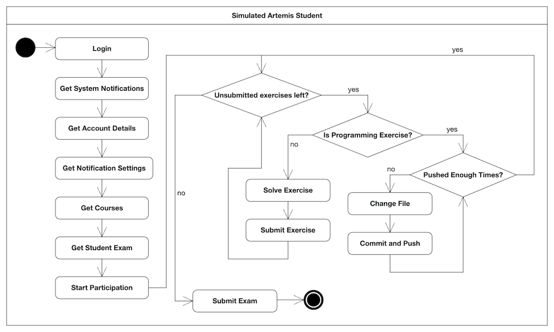

# Artemis Benchmarking-Tool

The Artemis Benchmarking-Tool is a web application that can be used to simulate the workload of a large number of students on an Artemis instance. The application provides functionality to evaluate the performance of Artemis and to identify bottlenecks. It is part of the Artemis project, which is developed at the Chair of Applied Software Engineering at the Technical University of Munich.

The tool`s main functionality is to simulate exam conductions on Artemis with a large number of students.
It does so by mirroring the actions of students on Artemis, such as logging in, starting an exam, submitting exercises, and submitting the exam by sending HTTP requests to the Artemis server.
During the simulation, the tool collects performance metrics such as the response times of the Artemis server and the number of requests.
It can also be connected to Prometheus to collect additional metrics such as the CPU usage of the Artemis server.

To simplify the simulation process, the tool can create courses and exams on Artemis. It can also be used to create test users on Artemis, which are used to simulate the students.

The Benchmarking-Tool is a Jhipster application. For more information about Jhipster, see the [JHipster Homepage and latest documentation].

## Setup

The Benchmarking Tool is a Spring Boot application with an Angular client. It requires a MySQL database server.
To start a MySQL server in a Docker container, run:

```
docker compose -f src/main/docker/mysql.yml up -d
```

### Configuration

Before running the application, you need to specify some configuration options. The configuration files are located in `src/main/resources/config/`.

Some of these values are confidential and should not be committed to the repository. For a development setup, you can use the `src/main/resources/config/application-local.yml` file to store these values. The `application-local.yml` file is already added to the `.gitignore` file and will be used when running the application in the `local` profile.
For a production environment, the configuration should be set using environment variables.

- For the database (in a development environment, the default config should be sufficient):
  - `spring.datasource.url`: The URL of the database.
  - `spring.datasource.username`: The username to connect to the database.
  - `spring.datasource.password`: The password to connect to the database.
- For the connection to Prometheus:
  - `prometheus.api-url`: The URL of the Prometheus server.
  - `prometheus.auth-token`: The base64 encoded basic-auth token to authenticate with the Prometheus server.
- For the mail service:
  - `spring.mail.host`: The host of the mail server.
  - `spring.mail.port`: The port of the mail server.
  - `spring.mail.username`: The username to connect to the mail server.
  - `spring.mail.password`: The password to connect to the mail server.
  - `jhipster.mail.from`: The email address to send emails from.
  - `jhipster.mail.base-url`: The base URL of the application.
- Security:
  - `jhipster.security.authentication.jwt.base64-secret`: The base64 encoded secret to sign the JWT tokens. If the application is not reachable from the internet, the default value should be sufficient.

The Benchmarking Tool can be connected to a number of Artemis Servers (currently TS1, TS3, TS7, TS8, STAGING, STAGING2, PRODUCTION).
For each server, a number of configuration values needs to be set.
Prefix all the following keys with `artemis.{server}.`, e.g., `artemis.ts1.`:

- `url`: The URL of the Artemis Server.
- `cleanup-enabled`: Whether the tool should clean up (i.e., delete created courses and exams) after the simulation. Since deleting large courses and exams can cause massive load on the Artemis system, we recommend to disable this option. If enabled, the [CI Status](#ci-status) will not be available.
- `is-local`: Whether the Artemis server uses the Integrated Code Lifecycle setup. This is important for fetching the [CI Status](#ci-status) after the simulation.
- `prometheus-instances.artemis`: The name of the Prometheus instance for the Artemis Server.
- `prometheus-instances.vcs`: The name of the Prometheus instance for the Version Control System of the Artemis Server.
- `prometheus-instances.ci`: The name of the Prometheus instance for the CI system of the Artemis Server.

### Building for production

To build the application as a JAR for production, run:

```
./gradlew -Pprod clean bootJar
```

This will create a JAR file in the `build/libs` directory.

Alternatively, you can build a WAR file by running:

```
./gradlew -Pprod -Pwar clean bootWar
```

After executing the JAR or WAR file, the application will be available on http://localhost:8080.

### Running with IntelliJ run configurations

For development, the recommended way to run the application is to use the provided IntelliJ run configurations.
They all use the `local` profile, which is configured to use the `application-local.yml` file for configuration.

- `Benchmarking (Server)`: Starts the application with the `dev` profile.
- `Benchmarking (Server-Prod)`: Starts the application with the `prod` profile.
- `Benchmarking (Client)`: Starts the client separately. This allows to use Angular's live-reload feature.

We recommend running the server and client separately during development by running `Benchmarking (Server)` (or Server-Prod) and `Benchmarking (Client)`.
The application will be available on http://localhost:9000 with Angular's live-reload feature enabled.

### Docker Setup

You can build a Docker image of the application by running

```
npm run java:docker
```

or

```
npm run java:docker:arm64
```

for arm64 processors like Mac with the M1 processor family.

This will create a Docker image named `artemis-benchmarking` in the production profile.
To run the Docker image, you can use the docker-compose file `src/main/docker/app.yml`.
This will also start a MySQL server.

After starting the containers with

```
docker compose -f src/main/docker/app.yml up -d
```

the application will be available on http://localhost:8080.

Instead of creating a Docker image, you can use the [latest published Docker image](https://github.com/ls1intum/Artemis-Benchmarking/pkgs/container/artemis-benchmarking) from the GitHub Container Registry.
To start a container with that image, you can use the docker-compose file `docker-compose.yml` by running

```
docker compose up -d
```

This will also start a MySQL server.
The application will be available on http://localhost:8080.
When using this docker-compose file, you can set the environment variables in the files `config/benchmarking.env` and `config/mysql.env`.
The published Docker image is not compatible with arm64 processors and will not work on Mac with the M1 processor family.

### User Management

On the first start with a new database, the application will create a default admin user with the username `admin` and the password `admin`.
If the application is reachable from the internet, it is necessary to change the password of the admin user immediately after the first login.

The application comes with two user roles: `ROLE_ADMIN` and `ROLE_USER`, but only the `ROLE_ADMIN` has access to the application's functionality.

Administrators can create new users in the `Administration > User Management` section of the application. New users can not register themselves.

## Development

Please read the [Setup section](#setup) to learn how to configure and run the application for development.

The application consists of a Spring Boot server and an Angular client. The server is located in the `src/main/java` directory and the client in the `src/main/webapp` directory.

### Server

The server is a Spring Boot application written in Java. The file structure is organized as follows:

- `artemisModel`: Contains the models of Artemis entities. These models are used to map the JSON responses from the Artemis Server to Java objects.
- `config`: Contains the configuration classes of the application.
- `domain`: Contains the JPA entities of the application. In most cases, these entities are mapped to tables in the database.
- `repository`: Contains the Spring Data repositories of the application. These repositories are used to access the database.
- `prometheus`: Contains classes that are used to retrieve data from Prometheus. The JSON responses from Prometheus are mapped to Java objects.
- `service`: Contains the service classes of the application. These classes contain the business logic of the application. They will be explained in more detail in the next section.
- `util`: Contains utility classes.
- `web.rest`: Contains the REST controllers of the application. These controllers are used to handle HTTP requests.
- `web.websocket`: Contains the service responsible for sending messages to the client using WebSockets.

The service layer is the most important part of the server. It contains the business logic of the application. The service classes are organized as follows:

- `artemis`: Contains the classes that are responsible for the interaction with Artemis.
  - `interaction`: Contains the classes that are responsible for interacting with Artemis. Objects of these classes represent Artemis users and send HTTP requests to Artemis.
  - `util`: Contains utility classes for the interaction with Artemis.
  - `ArtemisUserService`: The SpringBoot service that is responsible for the management of Artemis users. It is used to manage the credentials of the Artemis users that are used to interact with Artemis.
  - `ArtemisConfiguration`: The configuration that includes the information about the Artemis servers that the application can interact with.
- `simulation`:
  - `SimulationDataService`: The service responsible for creating simulations and runs, fetching simulation data etc.
  - `SimulationExecutionService`: The service responsible for executing a simulation run. It initializes the Artemis users and instructs them to interact with Artemis.
  - `SimulationQueueService`: The service responsible for managing the simulation queue. It adds new runs to the queue and starts the next run when the previous run is finished.
  - `SimulationResultService`: The service responsible for calculating the results of a simulation run afterwards.
  - `SimulationScheduleService`: The service responsible for scheduling simulations.
- `CiStatusService`: The service responsible for fetching the CI status after a simulation run.
- `PrometheusService`: The service responsible for fetching workload data from Prometheus.

The following diagram shows the hierarchy of the services involved in the simulation process:



### Client

The client is an Angular application written in TypeScript. The Angular Components are structured as follows:

The "Simulations" page is the most important page of the application. It is represented by the `SimulationsOverviewComponent`.
This component uses the `SimulationsService` to interact with the server.

The page for managing the Artemis Users is represented by the `ArtemisUsersComponent`. It uses the `ArtemisUserService` to interact with the server.

The subcomponents of the pages are located in the `layouts` directory.

The entities of the application are located in the `entities` directory.

### Database

The application uses a MySQL database. The database schema is managed by Liquibase. The changelog files are located in the `src/main/resources/config/liquibase` directory.
When creating a new changeset, orientate yourself on the existing changesets and follow the naming convention. Add the new changeset to the `master.xml` file.

The following diagram shows the current database schema:



### Dependency Management

On the server side, the application uses Gradle for dependency management. The dependencies are defined in the `build.gradle` file.
The versions of the most important dependencies are defined in the `gradle.properties` file. Updating them usually requires to upgrade the project to a new JHipster version.
This is a non-trivial task and should be done with caution in accordance with the [JHipster upgrade guide](https://www.jhipster.tech/upgrading-an-application/).

On the client side, the application uses NPM for dependency management. The dependencies are defined in the `package.json` file.

We use the GitHub Dependabot to keep the dependencies up to date. It creates pull requests with updated dependencies once per week. The configuration is located in the `.github/dependabot.yml` file.

### CI/CD

The application uses GitHub Actions for CI/CD. The workflows are located in the `.github/workflows` directory.

Each pull request to the `main` branch triggers the `ci.yml` workflow. This workflow builds the application and runs the tests. The results are visible in the pull request.

Each push to the `main` branch triggers the `deploy.yml` workflow. This workflow builds a Docker image of the application and pushes it to the GitHub Container Registry. A container with the new image is deployed to and started on the production server.
To manually trigger the deployment, simply re-run the workflow `Build and deploy to Prod` in the GitHub Actions tab. To rollback to a previous version, run the workflow for the respective commit.

### Adding new Artemis Servers

To add a new Artemis Server to the Benchmarking Tool, changes in four places are necessary. The changes are trivial and should not cause any problems.

1. In the configuration (e.g., `application.yml`), add a new section for the new server. Orientate yourself on the existing servers. See the [Configuration](#configuration) for more information.
2. In the server-side enum `ArtemisServer` (`src/main/java/de/tum/cit/ase/util/ArtemisServer.java`), add a new value for the new server.
3. In the `ArtemisConfiguration` class (`src/main/java/de/tum/cit/ase/service/artemis/ArtemisConfiguration.java`), add new fields for the new server. Orientate yourself on the existing servers.
4. In the client-side enum `ArtemisServer` (`src/main/webapp/app/core/util/artemisServer.ts`), add a new value for the new server. It must have the same name as the value in the server-side enum.

Removing an Artemis Server from the Benchmarking Tool is a similar process. Remove the corresponding sections from the configuration and the enums.
Please note that `TS1` is used as the default server in some places and for testing. If you remove `TS1`, you need to replace it with another server in these places.

### Coding and Design Guidelines

Please follow the coding and design guidelines of the Artemis project. The guidelines are documented in the [Artemis Docs](https://docs.artemis.cit.tum.de/dev/guidelines.html).

## Usage

### Artemis User Management

The Benchmarking Tool needs to interact with Artemis to perform the simulations. Therefore, it needs the credentials of Artemis users (students and admins / instructors) to log in and perform actions on Artemis.

The management of the Artemis users is done in the "Artemis Users" section of the application. Here, you can create new Artemis users, edit their credentials, and delete them.

For each Artemis server you can:

- Store the credentials of an admin user. This user is used for the preparation of the exam and the creation of the course and exam on Artemis.
- Add student users. These users are used to simulate the students that participate in the exam. There are three ways to add student users:
  - Manually add a user by entering its credentials.
  - Add users by defining patterns for the username and password. The tool will create users with the specified patterns.
  - Add users by uploading a CSV file with user data. The tool will read the user data from the file and create the users.
- Edit or delete users.

Each user has an ID. The ID is used to determine which users will participate in a simulation:

- If you specify the number of users in the simulation form, the tool will use the users with IDs 1 to n.
- If you specify the exact users that should participate in the simulation, you need to enter the IDs of the users.
- See [Creating a Simulation](#creating-a-simulation) for more information.

When you add users with patterns, you can additionally check the box `Create users on Artemis`. You will then be able to provide patterns for first name, last name, and email. The tool will try to create the users on Artemis with the specified patterns.
This is useful if your Artemis instance does not yet have the necessary amount of test users registered. This feature is only available if an Admin user is available for the respective Artemis server.
Please note that editing and deleting users in the Benchmarking Tool does not affect the users on Artemis.

When you add users through a CSV file, the file must have the following format:

```
username,password
user1,password1
user2,password2
user3,password3
```

Optionally, you can include the IDs of the users in the file. If you do not specify the IDs, the tool will assign the lowest free ID to each user.

```
id,username,password
1,user1,password1
2,user2,password2
```

**IMPORTANT**  
The Benchmarking Tool stores the credentials of the Artemis users in the database. Therefore, it is important to keep the database secure. The credentials are stored in plain text and can be accessed by anyone who has access to the database. The Benchmarking Tool should only be used in a secure environment.
**The database must only be accessible for people who are authorized to see the Artemis users' credentials. Only credentials of test users should be stored in the Benchmarking Tool.**

**Particularities for the Artemis production instance**  
For security reasons, it is not possible to store the credentials of an admin user of the Artemis production instance in the Benchmarking Tool.
Instead, those credentials can be entered when starting a simulation run. They will not be stored in the database and will only be used for the respective simulation run.

If you want to create [schedules](#scheduling-simulations) for a simulation against the Artemis production instance, that is only possible for simulation modes that do not require admin rights.
The credentials of an _Instructor_ (e.g. for the mode `Existing course, create exam`) can be specified when creating the simulation (or later). **They will be stored in the database!**
Make sure to use an account that only has Instructor rights in the course that you want to use for the simulation.

### Creating a Simulation

To create a new simulation, navigate to the "Simulations" page and click the "Create Simulation" button. Fill in the form and click the "Create Simulation" button again. The simulation will be added to the list of simulations.

Explanation of the form fields:

- `Name`: A name for the simulation.
- `Artemis Server`: The Artemis Server to run the simulation against.
- `Simulation Mode`: The mode of the simulation. The mode determines the preparation steps that the tool will perform before the simulation. The modes are:
  - `CREATE_COURSE_AND_EXAM`: The tool will create a course on Artemis and an exam in the course. The exam will contain 4 exercises (1 programming exercise, 1 modeling exercise, 1 quiz exercise, and 1 text exercise). The necessary number of students will be registered for the course and exam. In this mode, you do not need to perform any preparation steps on Artemis. The tool needs Admin permissions on Artemis (see [Artemis User Management](#artemis-user-management)).
  - `EXISTING_COURSE_CREATE_EXAM`: The tool will create an exam in an existing course on Artemis. The exam will contain 4 exercises (1 programming exercise, 1 modeling exercise, 1 quiz exercise, and 1 text exercise). The necessary number of students will be registered for the exam. In this mode, you need to create a course on Artemis manually and register the necessary users for the course. The tool needs Instructor permissions in the course (see [Artemis User Management](#artemis-user-management)).
  - `EXISTING_COURSE_UNPREPARED_EXAM`: The tool will not create a course or exam on Artemis. You need to create a course and an exam on Artemis manually and register the necessary users for the course and exam. The tool will perform the preparation of the exam (i.e., generating student exam and preparing the exercises for conduction). The tool needs Instructor permissions in the course (see [Artemis User Management](#artemis-user-management)).
  - `EXISTING_COURSE_PREPARED_EXAM`: The tool will not create a course or exam on Artemis. You need to create a course and an exam on Artemis manually and register the necessary users for the course and exam. The tool will not perform any preparation steps on Artemis. Instead, it assumes that the exam is already fully prepared for conduction.
- `Users`: The users that will participate in the simulation.
  - If the box `Customize` is not checked, you simply need to specify the number of users that will participate in the simulation. The tool will use the users with IDs 1 to n (see [Artemis User Management](#artemis-user-management)).
  - If the box `Customize` is checked, you can specify the exact users that will participate in the simulation. You need to specify the user IDs of the users that will participate in the simulation (see [Artemis User Management](#artemis-user-management)). The user IDs must be specified in the format `1,2,3-7,10,15,20-22`.
- Depending on the selected mode, you might need to fill in the `courseId` and `examId` fields.
- If you want to simulate against the Artemis Production instance and chose a mode that requires Instructor rights, you can optionally specify the necessary credentials. _They will be stored in the database!_ Please refer to the [Artemis User Management](#artemis-user-management) section for more information. This step is optional and can be done later.
- `Number of commits and pushes`: The range of pushes that users will perform per programming exercise. The tool will randomly choose a number of pushes for each user in the range.

### Running a Simulation

To run a simulation, find the simulation in the list of simulations and click the "Start Run" button. The new run will be added to the list of runs of the simulation.
Click on the run to see the details.
If the simulation is configured to run against production, you will need to confirm your choice and - depending on the mode - specify admin credentials through a dialog (see [Artemis User Management](#artemis-user-management) for more information).

The icon next to the run indicates the status of the run:

- `Queued`: The run is in the queue and will be started soon.
- `Running`: The run is currently running.
- `Finished`: The run has finished successfully.
- `Failed`: The run has failed.
- `Cancelled`: The run has been aborted.

During the simulation, the tool will perform the following steps for each student (in addition to the preparation steps):



While the simulation is running, you can see some log messages indicating the progress of the simulation. They will also show if something went wrong.
If the tool is connected to Prometheus, you can see the workload data of the configured Prometheus targets during the simulation.

If a fatal error occurs, the run will be stopped and marked as failed. You will be able to see the cause of the error in the log messages. If an error occurs for a single student, the simulation will continue for the other students.

You can click on "Abort" to cancel the simulation run. The tool will stop the simulation run as soon as possible. Please note that this might leave the exam in an inconsistent state.
Simulation results will not be calculated for aborted runs.

### Evaluating Simulation Results

After a simulation run has finished, the tool will calculate the results of the run.
The results consist of the number of requests and average response times for the following categories:

- `Authentication`: Authentication requests. Please note that the tool only sends authentication requests if no valid token is available for the respective user.
- `Get Student Exam`: Getting the student exam from Artemis.
- `Start Student Exam`: Starting the student exam on Artemis.
- `Submit Exercise`: Submitting an exercise to Artemis.
- `Submit Exam`: Submitting the student exam to Artemis.
- `Clone`: Cloning a repository for a programming exercise from the VCS.
- `Push`: Pushing a commit for a programming exercise to the VCS.
- `Misc`: Other, miscellaneous requests to Artemis.
- `Total`: All requests together.

The results are displayed in the detail view of the run. The metrics are also available in a per-minute resolution. If enough data is available, you can see the metrics in line-charts over time.

<a id="ci-status"></a>
If the simulation is running against an Artemis instance that uses the Integrated Code Lifecycle setup, the tool will fetch the CI status after the simulation. The CI status is displayed in the detail view of the run.
It includes the number of builds and the average builds per minute.

### Scheduling Simulations

The Benchmarking Tool can be used to schedule simulations. This is useful if you want to run simulations at a specific time or at regular intervals.

To schedule a simulation, click on the calendar icon of the respective simulation.
In the dialog that opens, you will see a list of existing schedules for the simulation.
Click on "Create Schedule" to create a new schedule.
In the form that opens, you can specify the following fields:

- `Cycle`: The repetition cycle of the schedule. The cycle can be `Daily` or `Weekly`.
- `From`: The start date of the time period in which the schedule will be active.
- `To`: The end date of the time period in which the schedule will be active. When reached, the schedule will be automatically deleted. If omitted, the schedule will be active indefinitely.
- `Time of Day`: The time of day at which the simulation will run.
- `Day of Week`: The day of the week on which the simulation will run. This field is only available if the cycle is `Weekly`.

After creating the schedule, it will be added to the list of schedules for the simulation.
You can edit or delete the schedule by clicking on the respective icons.

**Subscribing to a Schedule**  
Click on the Bell icon of the respective schedule to subscribe to it. You can specify your email address here.
After subscribing, you will receive an email notification containing a summary of the simulation results after every scheduled run.
To unsubscribe, click on the respective link in the email.

**Particularities for the Artemis production instance:**

- Simulations against production that require admin rights cannot be scheduled.
- For simulations that require instructor rights, the credentials need to be specified before creating the schedule.
- See [Artemis User Management](#artemis-user-management) for more information.

[JHipster Homepage and latest documentation]: https://www.jhipster.tech
[JHipster 8.1.0 archive]: https://www.jhipster.tech/documentation-archive/v8.1.0
[Using JHipster in development]: https://www.jhipster.tech/documentation-archive/v8.1.0/development/
[Using Docker and Docker-Compose]: https://www.jhipster.tech/documentation-archive/v8.1.0/docker-compose
[Using JHipster in production]: https://www.jhipster.tech/documentation-archive/v8.1.0/production/
[Running tests page]: https://www.jhipster.tech/documentation-archive/v8.1.0/running-tests/
[Code quality page]: https://www.jhipster.tech/documentation-archive/v8.1.0/code-quality/
[Setting up Continuous Integration]: https://www.jhipster.tech/documentation-archive/v8.1.0/setting-up-ci/
[Node.js]: https://nodejs.org/
[NPM]: https://www.npmjs.com/
[OpenAPI-Generator]: https://openapi-generator.tech
[Swagger-Editor]: https://editor.swagger.io
[Doing API-First development]: https://www.jhipster.tech/documentation-archive/v8.1.0/doing-api-first-development/
[Webpack]: https://webpack.github.io/
[BrowserSync]: https://www.browsersync.io/
[Jest]: https://facebook.github.io/jest/
[Leaflet]: https://leafletjs.com/
[DefinitelyTyped]: https://definitelytyped.org/
[Angular CLI]: https://cli.angular.io/
